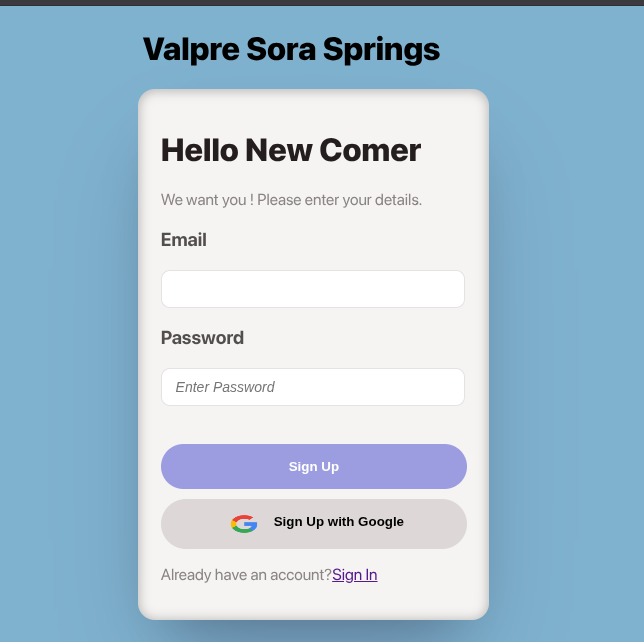

Valpre Sora Springs – Auth UI

A modern, minimal Sign In / Sign Up interface built with React.
Inspired by iOS design principles – smooth cards, soft shadows, and elegant typography.
The app features a simple toggle between Sign In and Sign Up, with a subtle background shift when switching views.

Features

 iOS-style UI – clean, rounded containers with glass-like shadows.

 Toggle between Sign In / Sign Up using one simple state.

Dynamic background – slightly darker when on Sign In for extra focus.

Form inputs for Email and Password.

 Google Auth button (styled with the Google logo).

 Lightweight & fast – only React state, no heavy libraries.

 How It Works

The toggle between Sign In and Sign Up is controlled by a single state:

const [signup, setSignup] = useState(true)
return signup ? <SignUp setSignup={setSignup} /> : <SignIn setSignup={setSignup} />

Inside SignUp.jsx, clicking Sign In flips the state to false.

Inside SignIn.jsx, clicking Sign Up flips the state to true.

The background color changes slightly depending on the state for a modern UX.

